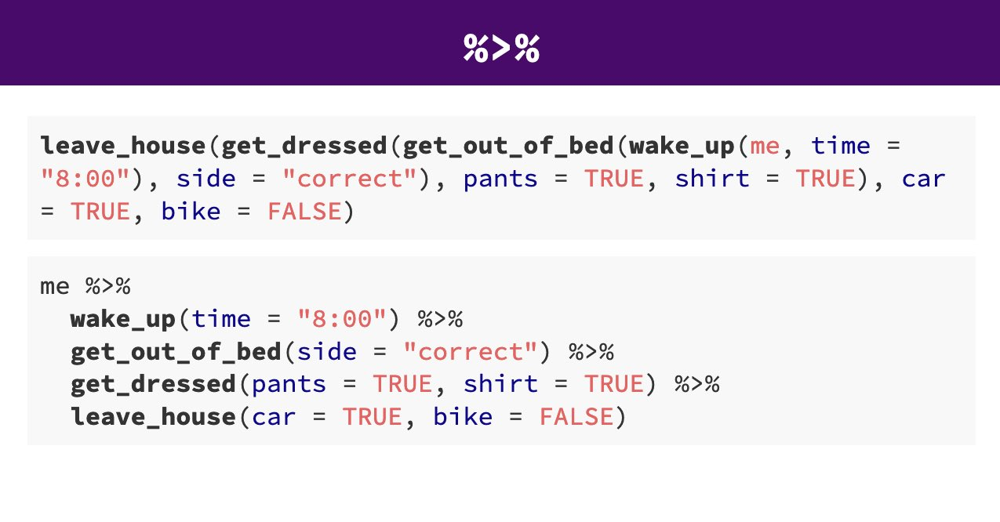

# Introduction to dplyr {#sec-dplyr}


```{r, echo = F, warning = F, message = F}
library(tidyverse)
library(janitor)
library(here)
source("R/booktem_setup.R")
source("R/my_setup.R")
penguins_raw <- read_csv(here("files", "penguins_raw.csv"))
```

In this chapter you will learn how to use tidyverse functions to data clean and wrangle `r glossary("tidy data")` introduced in @sec-tidy 

In this section we will be introduced to some of the most commonly used data wrangling functions, these come from the `dplyr` package (part of the `tidyverse`). These are functions you are likely to become *very* familiar with. 

::: {.callout-important}

Try running the following functions directly in your `r glossary("console")` *or* make a `scraps.R` scrappy file to mess around in. 

:::

## Overview

```{r, eval = TRUE, echo = FALSE, warning = FALSE, message = FALSE}
library(kableExtra)

verb <- c( "select()","filter()", "arrange()", "summarise()", "group_by()", "mutate()")

action <- c("choose columns by name","select rows based on conditions",  "reorder the rows", "reduce raw data to user defined summaries", "group the rows by a specified column", "create a new variable")

box <- tibble(verb, action)
box


```

## Select

If we wanted to create a dataset that only includes certain variables, we can use the `dplyr::select()` function from the `dplyr` package. 

For example I might wish to create a simplified dataset that only contains `species`, `sex`, `flipper_length_mm` and `body_mass_g`. 

Run the below code to select only those columns

```{r, eval = FALSE}
select(
   # the data object
  .data = penguins_raw,
   # the variables you want to select
  `Species`, `Sex`, `Flipper Length (mm)`, `Body Mass (g)`)
```


Alternatively you could tell R the columns you **don't** want e.g. 


```{r, eval = F}
select(.data = penguins_raw,
       -`studyName`, -`Sample Number`)

```

Note that `select()` does **not** change the original `penguins` tibble. It spits out the new tibble directly into your console. 

If you don't **save** this new tibble, it won't be stored. If you want to keep it, then you must create a new object. 

When you run this new code, you will not see anything in your console, but you will see a new object appear in your Environment pane.

```{r, eval = F}
new_penguins <- select(.data = penguins_raw, 
       `Species`, `Sex`, `Flipper Length (mm)`, `Body Mass (g)`)
```

## Filter

Having previously used `dplyr::select()` to select certain variables, we will now use `dplyr::filter()` to select only certain rows or observations. For example only Adelie penguins. 

We can do this with the equivalence operator `==`

```{r, eval = F}
filter(.data = new_penguins, 
       `Species` == "Adelie Penguin (Pygoscelis adeliae)")

```

We can use several different operators to assess the way in which we should filter our data that work the same in tidyverse or base R.

```{r, eval = TRUE, echo = FALSE, warning = FALSE, message = FALSE}

Operator <- c("A < B", "A <= B", "A > B", "A >= B", "A == B", "A != B", "A %in% B")

Name <- c("less than", "less than or equal to", "greater than", "greater than or equal to", "equivalence", "not equal", "in")

box <- tibble(Operator, Name)

box |> 
   kbl(caption = "Boolean expressions", 
    booktabs = T) |> 
   kable_styling(full_width = FALSE, font_size=16)

```

If you wanted to select all the Penguin species except Adelies, you use 'not equals'.

```{r, eval = F}
filter(.data = new_penguins, 
       `Species` != "Adelie Penguin (Pygoscelis adeliae)")

```

This is the same as 

```{r, eval = F}
filter(.data = new_penguins, 
       `Species` %in% c("Chinstrap penguin (Pygoscelis antarctica)",
                      "Gentoo penguin (Pygoscelis papua)")
       )
```

You can include multiple expressions within `filter()` and it will pull out only those rows that evaluate to `TRUE` for all of your conditions. 

For example the below code will pull out only those observations of Adelie penguins where flipper length was measured as greater than 190mm. 

```{r, eval =F}

filter(.data = new_penguins, 
       `Species` == "Adelie Penguin (Pygoscelis adeliae)", 
       `Flipper Length (mm)` > 190)

```

## Arrange

The function `arrange()` sorts the rows in the table according to the columns supplied. For example


```{r, eval = F}
arrange(.data = new_penguins, 
        `Sex`)
```


The data is now arranged in alphabetical order by sex. So all of the observations of female penguins are listed before males. 

You can also reverse this with `desc()`

```{r, eval = F}

arrange(.data = new_penguins, 
        desc(`Sex`))

```

You can also sort by more than one column, what do you think the code below does?

```{r, eval = F}
arrange(.data = new_penguins,
        `Sex`,
        desc(`Species`),
        desc(`Flipper Length (mm)`))
```

## Mutate

Sometimes we need to create a new variable that doesn't exist in our dataset. For example we might want to figure out what the flipper length is when factoring in body mass. 

To create new variables we use the function `mutate()`. 

Note that as before, if you want to save your new column you must save it as an object. Here we are mutating a new column and attaching it to the `new_penguins` data oject.


```{r, eval = F}
new_penguins <- mutate(.data = new_penguins,
                     body_mass_kg = `Body Mass (g)`/1000)
```

## Pipes

```{r, eval=TRUE, echo=FALSE, out.width="80%", fig.alt= "Pipes make code more human readable"}

```

Pipes look like this: `|>` , a `r glossary("pipe")` allows you to send the output from one function straight into another function. Specifically, they send the result of the function before `|>` to be the **first** argument of the function after `|>`. As usual, it's easier to show, rather than tell so let's look at an example.

```{r, eval = F}
# this example uses brackets to nest and order functions
arrange(.data = filter(
  .data = select(
  .data = penguins_raw, 
  species, `Sex`, `Flipper Length (mm)`), 
  `Sex` == "MALE"), 
  desc(`Flipper Length (mm)`))

```

```{r, eval = F}
# this example uses sequential R objects 
object_1 <- select(.data = penguins_raw, 
                   `Species`, `Sex`, `Flipper Length (mm)`)
object_2 <- filter(.data = object_1, 
                   `Sex` == "MALE")
arrange(object_2, 
        desc(`Flipper Length (mm)`))

```

```{r, eval = F}
# this example is human readable without intermediate objects
penguins_raw |>  
  select(`Species`, `Sex`, `Flipper Length (mm)`) |>  
  filter(`Sex` == "MALE") |>  
  arrange(`Flipper Length (mm)`))
```

The reason that this function is called a pipe is because it 'pipes' the data through to the next function. When you wrote the code previously, the first argument of each function was the dataset you wanted to work on. When you use pipes it will automatically take the data from the previous line of code so you don't need to specify it again.

### Task

Try and write out as plain English what the |>  above is doing? You can read the |>  as THEN


`r hide("Solution")`

Take the penguins data AND THEN
Select only the species, sex and flipper length columns AND THEN
Filter to keep only those observations labelled as sex equals male AND THEN
Arrange the data from HIGHEST to LOWEST flipper lengths.


:::{.callout-note}
# Base pipe |> and Magrittr %>%

From R version 4 onwards there is now a "native pipe" `|>`

This doesn't require the tidyverse `magrittr` package and the "old pipe" ` %>% ` or any other packages to load and use. 

You may be familiar with the magrittr pipe or see it in other tutorials, and website usages. The native pipe works equivalntly in most situations but if you want to read about some of the operational differences, [this site](https://www.infoworld.com/article/3621369/use-the-new-r-pipe-built-into-r-41.html) does a good job of explaining .


:::


## Group by

The `group_by()` function is used to tell R that you want to perform operations **within groups** of your data rather than across the whole dataset.

Think of it as adding a “temporary label” to each row that says which group it belongs to. Then, when you use functions like `summarise()`, R performs the summary for each group separately.

Let’s say you want to find the average flipper length for each penguin species.

Without grouping we get a single value:

```{r}
penguins_raw |>  
  summarise(mean_flipper = mean(`Flipper Length (mm)`, na.rm = TRUE))
```

**With grouping**:

Gives one number **per species**

```{r}
penguins_raw |> 
  group_by(`Species`) |> # select our variable that contains the groups
  summarise(mean_flipper = mean(`Flipper Length (mm)`, na.rm = TRUE),
            .groups = "drop" ) # remove groups after calculation
```

### Grouping by multiple variables

```{r}
penguins_raw |> 
  group_by(`Species`, `Sex`) |> 
  summarise(mean_flipper = mean(`Flipper Length (mm)`, na.rm = TRUE),
            .groups = "drop")


```

:::{.callout-note}

You can think of `group_by()` as sorting your dataset into bins, one bin per group. Then, when you `summarise()` or `mutate()`, you’re performing that operation inside each bin.

:::

## Glossary

```{r, echo = FALSE}
glossary_table()
```
