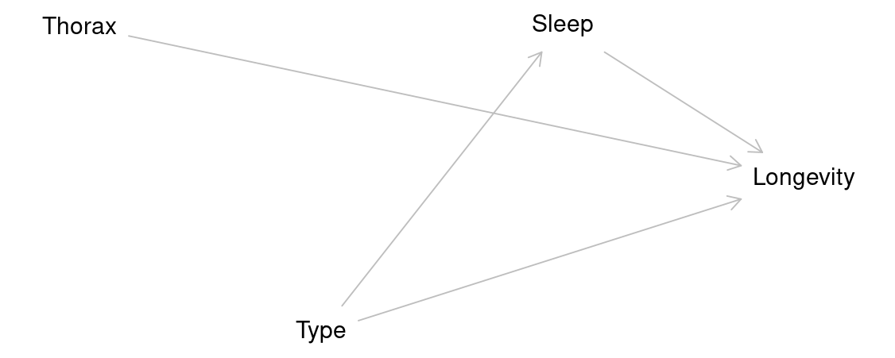

# Linear Models

```{r, include = FALSE}
source("R/booktem_setup.R")
source("R/my_setup.R")
library(tidyverse)
library(here)
dros_clean <- read_csv(here("files", "fruitfly.csv"))
library(GGally)
library(skimr)
library(GGally)
library(ggridges)
library(performance)
library(patchwork)

colours <- c("cyan", "darkorange", "purple")
```


```{r, eval = FALSE}
# Required packages
library(here)
library(tidyverse)
library(GGally)
library(skimr)
library(GGally)
library(ggridges)
library(performance)
library(patchwork)

```


## Designing a Model

We are introduced to the fruitfly dataset (Partridge and Farquhar (1981))[https://nature.com/articles/294580a0]. From our understanding of sexual selection and reproductive biology in fruit flies, we know there is a well established 'cost' to reproduction in terms of reduced longevity for female fruitflies. The data from this experiment is designed to test whether increased sexual activity affects the lifespan of male fruitflies.

The flies used were an outbred stock, sexual activity was manipulated by supplying males with either new virgin females each day, previously mated females ( Inseminated, so remating rates are lower), or provide no females at all (Control). All groups were otherwise treated identically.

* **type**: type of female companion (virgin, inseminated, control(partners = 0))

* **longevity**: lifespan in days

* **thorax**: length of thorax in micrometres (a proxy for body size)

* **sleep**: percentage of the day spent sleeping


### Hypotheses

- Flies paired with non-virgin females do not live as long, they expend more energy trying to mate with previously mated females.

```

lm(longevity ~ type, data = dros_clean)

```

## Checking the data

A quick intro to a general overview

This is a full two-by-two plot of the entire dataset, but you should try and follow this up with some specific plots. 

```{r, eval = TRUE, warning = FALSE, message = FALSE}

GGally::ggpairs(dros_clean)

```


:::{.task}
::::{.task-header}
Your turn
::::
::::{.task-container}

- Make a Boxplot / Density distribution of longevity split by the female type with which males have been paired

::::
:::


`r hide("Solution")`

:::{.panel-tabset}

## Density plot

```{r, message = FALSE, eval = TRUE}

colours <- c("cyan", "darkorange", "purple")

dros_clean |> 
  ggplot(aes(x = longevity, y = type, fill = type))+
  geom_density_ridges(alpha = 0.5)+
  scale_fill_manual(values = colours)+
  theme_minimal()+
  theme(legend.position = "none")


```


## Boxplot

```{r, message = FALSE, eval = TRUE}

colours <- c("cyan", "darkorange", "purple")

dros_clean |> 
  ggplot(aes(x = longevity, y = type, fill = type))+
  geom_density_ridges(alpha = 0.5)+
  scale_fill_manual(values = colours)+
  theme_minimal()+
  theme(legend.position = "none")


```


:::


`r unhide()`

## Designing a model

In this section, we explore how to construct a statistical model to analyse biological data. Specifically, we will build a linear model to examine the effects of mating type on longevity in Drosophila melanogaster. .

Using the `lm()` function in R, we fit a model to our cleaned dataset, and generate a summary of the results. This approach allows us to assess the significance of each predictor and interpret how these factors influence longevity. By the end of this section, you will understand how to structure a model, choose appropriate variables, and interpret statistical outputs.

```{r}
# a linear model
flyls1 <- lm(longevity ~ type, data = dros_clean)

```

:::{.panel-tabset}

## `summary`

```{r}

summary(flyls1)

```


## `broom`

```{r}

broom::tidy(flyls1)

```

:::


## Interpreting a model

### Call : What model was fitted
      
      - `lm(formula = longevity ~ type, data = dros_clean)`
      
###  Residuals: How well the model fits

```
   Min     1Q Median     3Q    Max 
-31.74 -13.74   0.26  11.44  33.26 
```

### Coefficients: 

```
                Estimate Std. Error t value Pr(>|t|)    
(Intercept)       63.560      3.158  20.130  < 2e-16 ***
typeInseminated    0.520      3.867   0.134    0.893    
typeVirgin       -15.820      3.867  -4.091 7.75e-05 ***
```

| Term                | Interpretation                                                                                          |
| ------------------- | ------------------------------------------------------------------------------------------------------- |
| **(Intercept)**     | Mean longevity for the **reference group** (here: *Mated males*, if that’s baseline). → ≈ **63.6 days** |
| **typeInseminated** | Difference from baseline: ≈ **+0.5 days** (ns, *p* = 0.893)                                             |
| **typeVirgin**      | Difference from baseline: ≈ **−15.8 days** (**p** < 0.001) → Virgins live ~16 days shorter              |

###  Model fit

```
Residual SE: 15.79 on 122 DF
Multiple R-squared: 0.2051
Adjusted R-squared: 0.1921
F-statistic: 15.74 on 2 and 122 DF, p-value: 8.31e-07
```

| Metric          | Meaning                                                                | Interpretation               |
| --------------- | ---------------------------------------------------------------------- | ---------------------------- |
| **Residual SE** | Typical deviation of observations from model predictions (≈ 15.8 days) | Smaller = better fit         |
| **R² = 0.205**  | % of variance in longevity explained by mating type                    | ≈ 20% of variation explained |
| **Adjusted R²** | Adjusts for # predictors                                               | Still 0.19 → stable          |
| **F-test**      | “Does `type` matter overall?”                                          | Yes (**p < 0.001**)          |


## Confidence intervals

When we produce a model fit - it is useful to think in terms of *confidence intervals* and estimate differences rather than just p-values. 

A 95% confidence interval give us our confidence in having captured the true difference between groups at p = 0.05


:::{.panel-tabset}

## Added to model summary
```{r}

broom::tidy(flyls1, conf.int = T)

```

## Visualised

```{r}
GGally::ggcoef_model(flyls1)
```

:::

`r hide("Interpretation")`

| Term            | Estimate | 95% CI        | Interpretation                                                                                                                                                                                                |
| --------------- | -------- | ------------- | ------------------------------------------------------------------------------------------------------------------------------------------------------------------------------------------------------------- |
| (Intercept)     | 63.6     | (57.3, 69.8)  | Baseline longevity — flies in the **reference group** (mated males) live about 64 days on average. We are 95% confident the true mean lies between 57 and 70 days.                                            |
| typeInseminated | 0.52     | (−7.1, 8.2)   | Flies with **inseminated partners** live about 0.5 days longer than the reference group, but the 95% CI spans both negative and positive values — from −7 to +8 days — indicating **no clear difference**.    |
| typeVirgin      | −15.8    | (−23.5, −8.2) | Flies paired with **virgin partners** live roughly **16 days shorter** on average. The 95% CI (−23.5 to −8.2) does **not include zero**, within our confidence intervals we know that the **true difference** is at least **8.2 days** |


`r unhide()`


## Add a covariate

In a basic linear model, we often start by comparing group means — for example:

$$
\text{longevity}_i = \beta_0 + \beta_1 \, \text{type}_i + \varepsilon_i
$$

This model assumes that differences in **longevity are entirely due to type** (e.g., mating partner).

But in real data, **other variables** may also influence the outcome — for example, body size might affect how long flies live.

If **mean body size happens to vary slightly between groups**, failing to include it could confound our estimate of the effect of type.

By adding it as a *covariate*, we adjust for this additional source of variation:

$$
\text{longevity}_i = \beta_0 + \beta_1 \, \text{type}_i + \beta_2 \, \text{thorax}_i + \varepsilon_i
$$

### Interpretation

- The coefficient 𝛽1 represents the effect of mating type, after adjusting for body size.

- The coefficient 𝛽2 represents how longevity changes with body size, holding type constant.

- Including covariates often reduces residual variation and improves model fit.

```{r}
flyls2 <- lm(longevity ~ type + thorax, data = dros_clean)
```


:::{.task}
::::{.task-header}
Your turn
::::
::::{.task-container}

* [ ] Fit the updated model

* [ ] What does it say about the effect of body size (thorax) on longevity?

* [ ] What is the adjusted effect of the type on longevity?


`r hide("Solution)`

```{r}
summary(flyls2)
```

`r unhide()`


`r hide("Mean centering")`

When we use continuous predictors, the intercept becomes the expected value of our outcome (longevity), when all predictors are 0. This can make the intercept an unrealistic value. 

One way around this is to "center" the continuous predictors - so that 0 now becomes the mean value of the predictor

```{r}
dros_clean$thorax_c <- scale(dros_clean$thorax, scale = FALSE)

flyls2_c <- lm(longevity ~ type + thorax_c, data = dros_clean)

summary(flyls2_c)

```

`r unhide()`

::::

:::

## Compare the models

Compare to the simpler model:

```{r}
anova(flyls1, flyls2)
```

The ANOVA tests whether adding body_size significantly improves the model.

## Test for interaction

Sometimes, the relationship between a covariate and the outcome *differs between groups*.

To test this, include an interaction term:

$$
\text{longevity}_i = \beta_0 + \beta_1 \, \text{type}_i + \beta_2 \, \text{body\_size}_i + \beta_3 \, (\text{type}_i \times \text{body\_size}_i) + \varepsilon_i
$$

This allows the **slope of body size to vary by type** — in other words, the effect of size depends on mating partner.

```{r}

flyls3 <- lm(longevity ~ type + 
               thorax + 
               type:thorax, # specifies the interaction effect
             data = dros_clean)

summary(flyls3)


```

- A significant interaction (𝛽3) means the relationship between body size and longevity is **not the same** across partner types.

Compare to the simpler model:

```{r}
anova(flyls2, flyls3)
```

## Model checking

Before we can interpret the terms in our model, we should check to see if this is even a good way of fitting and measuring our data. We should check the assumptions of our model are being met.

```{r, eval = TRUE, message = FALSE, warning = FALSE, fig.height=9}

performance::check_model(flyls2,
                         detrend = F)

```

- Posterior Predictive Check – Assesses whether the model’s predicted values align well with the observed data, indicating good model fit.

- Linearity Check – Ensures that the relationship between predictor variables and the outcome is approximately linear, a key assumption of linear regression.

- Homogeneity of Variance Check – Tests whether residuals (errors) have constant variance across all levels of predictors, known as homoscedasticity.

- Influential Observation Check – Identifies individual data points that have a disproportionately large impact on the model’s estimates.

- Collinearity Check – Detects whether predictor variables are highly correlated with each other, which can distort model estimates and reduce interpretability.

- Normality Check – Examines whether the residuals of the model follow a normal distribution, an assumption necessary for reliable inference in linear regression.

### Homogeneity of variance

**Question - IS the assumption of homogeneity of variance met?** `r mcq(c( answer = "Yes", "No"))`

`r hide("Solution")`

* Mostly - the reference line is fairly flat (there is a slight curve).

* It looks as though there might be some increasing heterogeneity with larger values, though very minor.

VERDICT, pretty much ok, should be fine for making inferences. 

With a slight curvature this could indicate that you *might* get a better fit with a transformation, or perhaps that there is a missing variable that if included in the model would improve the residuals. In this instance I wouldn't be overly concerned. See here for a great explainer on intepreting residuals^[https://www.qualtrics.com/support/stats-iq/analyses/regression-guides/interpreting-residual-plots-improve-regression/].

```{r}
# Runs a Breusch-Pagan Test for heteroscedasticity
# Sensitive to outliers, non-normality and sample size
performance::check_heteroscedasticity(flyls2)

```

`r unhide()`

### Normality of residuals

`r mcq(c(answer = "Yes", "No"))`

`r hide("Solution")`
Yes - the QQplot looks pretty good, a very minor indication of a right skew, but nothing to worry about. 

[Interpreting QQ plots][What is a Quantile-Quantile (QQ) plot?]

```{r}
# Runs a Shapiro Wilk test of normality
# Sensitive to outliers, sample size
performance::check_normality(flyls2)
```

`r unhide()`


### Collinearity

**Question - IS their an issue with Collinearity?** `r mcq(c("Yes", answer ="No"))`

:::{.callout-tip}

What does it mean to have (multi)collinearity?

This is when one or more predictors are correlated - leading to increased uncertainty about their contributions to the outcome variable. 

The result is wider standard error and confidence intervals. 

While there are many discussions about what can be done with multicollinearity - I subscribed to the views outlined [here](https://janhove.github.io/posts/2019-09-11-collinearity/). 

It should be reported - but that's it - it represents genuine uncertainty around the contributions of your predictors. 

```{r}
car::vif(flyls2)

```

:::

## Estimating means and comparisons

Using the [emmeans](https://aosmith.rbind.io/2019/03/25/getting-started-with-emmeans/) package is a very easy way to produce the estimate mean values (rather than mean differences) for different categories `emmeans`. 

```{r}

means <- emmeans::emmeans(flyls2, specs = 
                   ~ type + thorax)

means

```

If the term `pairs()` is included then it will also include post-hoc pairwise comparisons between all levels with a tukey test (adjustment for multiple comparisons) `contrasts`.

```{r}

pairs(means)

```

:::{.callout-tip collapse ="true"}

## Continuous predictions

For continuous variables (sleep and thorax) - `emmeans` has set these to the mean value within the dataset, so comparisons are constant between categories at the average value of all continuous variables. If we wish to model continuous predictions we need to specify these:

```{r}

emmeans::emmeans(flyls2, 
                 specs = ~ type + thorax,
                 at = list(thorax = seq(0.64,0.94, .1)))

```

:::

## Model reporting

We have now generated a lot of information from our models - using confidence intervals we can make statements about measured differences and levels of uncertainty around our inferences.

`r hide("Solution")`

- Our control treatment of flies had a mean lifespan of 61.4 days [95%CI: 56.9 - 65.9] at the average thorax size of 0.82mm. 

- Thorax size was a significant predictor of longevity (t121 = 10.99, p<0.001), with every additional mm adding a minimum avergae of 11.7 days to lifespan (Estimate = 14.3 [11.7 - 16.9]).

- Treatment (in the form of exposure to different female mating types) had a strong overall effect on longevity (F~1~21~) = 121, p <0.001. Males paired with virgin flies lived an average of 13.3 days [7.9 - 18.8] less than control flies. 

- A post-hoc comparison (Tukey HSD) found that males paired with virgin lifes had reduced longevity compared to males paired with both Control and Inseminated females, there was no statisticall significant difference between males paired with Control and Inseminated females. 

- Overall the model explained 59% of the observed variance in lifespan (Adjusted R2 = 0.59). 


`r unhide()`


## Causal inference

A regression model can be used for prediction or for causal inference.

If your goal is to estimate the effect of a variable (e.g., the effect of mating partner on longevity),
you must think carefully about which variables to control for and which to exclude.

### Experimental design

Your experimental design is the foundation.

- If you randomly assign treatments (e.g., mating partner type), randomization already balances other factors on average — you don’t need to adjust for everything.

- But for small groups/studies there could be minor imbalances and including the term might help make more precise estimates.

    - If the study is large enough body size differences should smooth out - perhaps it doesn't need to be adjusted for? 
    
- Body size *could* moderate the treatment effect (change the way mating partner type affects longevity)

- Variables measured **after** treatment (like sleep) should not be adjusted for if they’re potential **mediators**.

    - The type of female a male is paired with might affect how much sleep he gets? 


```{r, eval=TRUE, echo=FALSE, out.width="80%"}

```
If we did include sleep in our models it might **block** part of the causal effect of type on longevity that flows *through sleep*. 

```{r}

flyls4 <- lm(longevity ~ type + thorax + sleep, data = dros_clean)

summary(flyls4)

```

In this case we can see that the estimate of the effect of type on longevity has *changed*. 

Our model now only estimates the effect of type on longevity that isn't *mediated by sleep*. 

### Causality terms

| Variable type           | Definition                                                                                                     | Example                                 | Include?               | Why                                                                                                                 |
| ----------------------- | -------------------------------------------------------------------------------------------------------------- | --------------------------------------- | ---------------------- | ------------------------------------------------------------------------------------------------------------------- |
| **Confounder**          | A variable that influences both the treatment and the outcome, creating a spurious association.                | (None here; randomization removes them) | ✅                      | Removes bias by blocking non-causal paths between treatment and outcome.                                            |
| **Mediator**            | A variable that lies on the causal path between treatment and outcome, transmitting part of the effect.        | Sleep                                   | 🚫                     | Excluding it gives the **total effect** of treatment on outcome; including it estimates only the **direct effect**. |
| **Precision covariate** | A variable related to the outcome but not to treatment; not a confounder but helps explain residual variation. | Thorax                                  | ✅ (optional)           | Improves precision by reducing unexplained variance; doesn’t change the causal estimate.                            |
| **Moderator**           | A variable that changes (modifies) the strength or direction of the treatment effect.                          | Thorax × Type                           | ✅ (if theory suggests) | Tests whether the effect of treatment depends on another factor (e.g., body size).                                  |


Choosing which variables to include in a model requires careful thought because each term represents an assumption about the causal structure of the system. Confounders must be included to remove bias, mediators excluded if we want the total effect, and moderators or precision covariates added only when theory or design supports their relevance. In short, a good model reflects not just the data we have, but the experiment we designed and the biological relationships we believe exist.

```{r, include = FALSE}
marginal1 <- dros_clean |> 
  ggplot()+
  geom_density(aes(x = thorax, fill = type),
               alpha = 0.5)+
  scale_fill_manual(values = colours)+
  theme_void()+
  theme(legend.position = "none")

# density plot of longevity by treatment
marginal2 <- dros_clean |> 
  ggplot()+
  geom_density(aes(x = longevity, fill = type),
               alpha = 0.5)+
  scale_fill_manual(values = colours)+
  theme_void()+
  coord_flip()


# create a new dataset where all sleep values are set to a constant (mean) values - see the emmeans table

means <- emmeans::emmeans(flyls1, 
                 specs = ~ type + thorax + sleep,
                 at = list(thorax = seq(0.64,0.94, .1))) |> 
  as_tibble()

# use the final model to produce model predictions set to the new constant sleep dataframe
model_plot <- ggplot(means, aes(x=thorax, y = emmean, colour = type, fill = type))+
  geom_ribbon(aes(ymin=lower.CL, ymax=upper.CL), alpha = 0.2)+
    geom_line(linetype = "dashed", show.legend = FALSE)+
  geom_point(data = dros_clean, aes(x = thorax, y = longevity),
             show.legend = FALSE)+
  scale_colour_manual(values = colours)+
  scale_fill_manual(values = colours)+
  labs(y = "Lifespan in days",
       x = "Thorax length (mm)",
       fill = "Type of female exposure")+
  guides(colour = "none")+
  theme_classic()+
  theme(legend.position = "none")

layout <- "
AAA#
BBBC
BBBC
BBBC"


dros_plot <- marginal1+model_plot+marginal2 +plot_layout(design = layout)

saveRDS(dros_plot, "dros_plot")
```
