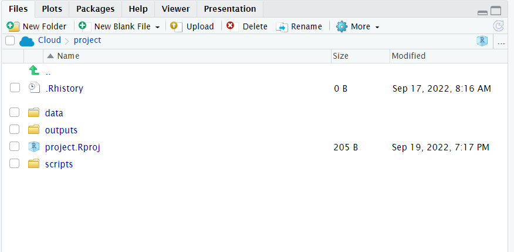
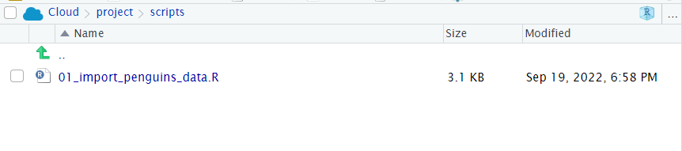

## Column classes & names {#sec-column-name}


```{r, echo = F, warning = F, message = F}
library(tidyverse)
library(janitor)
library(here)
source("R/booktem_setup.R")
source("R/my_setup.R")
penguins_raw <- read_csv(here("files", "penguins_raw.csv"))
```


This chapter explains how to check the class of each column and edit column names so that they are consistent and ready to use for analyses.

::: {.callout-warning}

Re-open your `01_import_penguins_data.R` started in @sec-penguins and start to add these commands to your data importing and cleaning script:

:::

## Column classes


::: {.panel-tabset}

## `glimpse()`

Using `glimpse()` displays the class beside each column name (e.g. `chr`)

```{r}
library(dplyr)
glimpse(penguins_raw)

```

## `str()`

Using `str()` displays the class after the column name and before the number of rows (e.g. `chr`)

```{r}

str(penguins_raw)

```


## `skim()`

The `skimr::skim()` function groups columns by their type/class.

```{r}
library(skimr)

skim(penguins_raw)

```

:::

If you are using a `tibble`, the class is also displayed below each column name when you view your data.

```{r, eval = FALSE}

penguins_raw

```

:::{.callout-note}
## Data classes

From these data overviews we've learned:

- Columns like `Species`, `Island`are strings of text (`character`)

- Columns like `Culmen Depth (mm)` and `Flipper Length (mm)` are numbers with decimal points (`double`)

:::


## Column names


```{r, eval = T}
# CHECK DATA----
# check the data
colnames(penguins_raw)
#__________________________----
```

When we run `colnames()` we get the identities of each column in our dataframe

* **Study name**: an identifier for the year in which sets of observations were made

* **Region**: the area in which the observation was recorded

* **Island**: the specific island where the observation was recorded

* **Stage**: Denotes reproductive stage of the penguin

* **Individual** ID: the unique ID of the individual

* **Clutch completion**: if the study nest observed with a full clutch e.g. 2 eggs

* **Date egg**: the date at which the study nest observed with 1 egg

* **Culmen length**: length of the dorsal ridge of the bird's bill (mm)

* **Culmen depth**: depth of the dorsal ridge of the bird's bill (mm)

* **Flipper Length**: length of bird's flipper (mm)

* **Body Mass**: Bird's mass in (g)

* **Sex**: Denotes the sex of the bird

* **Delta 15N** : the ratio of stable Nitrogen isotopes 15N:14N from blood sample

* **Delta 13C**: the ratio of stable Carbon isotopes 13C:12C from blood sample


#### Clean column names

Often we might want to change the names of our variables. They might be non-intuitive, or too long. Our data has a couple of issues:

* Some of the names contain spaces

* Some of the names have capitalised letters

* Some of the names contain brackets

R is case-sensitive and also doesn't like spaces or brackets in variable names, because of this we have been forced to use backticks \`Sample Number\` to prevent errors when using these column names.


:::{.callout-important collapse = "true"}
## Name consistency

Column names should use consistent naming conventions. R is case sensitive, so two names with the same letters but different capitalisations are considered different names (e.g. event vs. Event). Using a naming convention which is both human- and machine-readable (e.g. camel case, snake case), and being consistent in your usage of it, makes it less likely that you will make these sorts of errors.

- **Snake case** uses lowercase letters only, with words separated by an underscore _ (e.g. `scientific_name`, `data_resource_name`, `event_date`).

:::

One of the most useful column name cleaning functions is `janitor::clean_names()` from the janitor package @R-janitor. This function will make all of your column names consistent, based on your preferred naming convention (defaults to snake case).

```{r, eval = T, warning = F, message = F}
# CLEAN DATA ----

# clean all variable names to snake_case 
# using the clean_names function from the janitor package
# note we are using assign <- 
# to overwrite the old version of penguins 
# with a version that has updated names
# this changes the data in our R workspace 
# but NOT the original csv file

# clean the column names
# assign to new R object
penguins_clean <- janitor::clean_names(penguins_raw) 

# quickly check the new variable names
colnames(penguins_clean) 


```


`r hide ("Import and clean names")`

We can combine data import and name repair in a single step if we want to:

```{r, eval = FALSE}
penguins_clean <- read_csv ("data/penguins_raw.csv",
                      name_repair = janitor::make_clean_names)

```

`r unhide()`


#### Rename columns (manually)

The `clean_names` function quickly converts all variable names into `r glossary("snake case")`. The N and C blood isotope ratio names are still quite long though, so let's clean those with `dplyr::rename()` where "new_name" = "old_name".


```{r, eval = T, warning = F, message = F}

# shorten the variable names for isotope blood samples
# use rename from the dplyr package
penguins_clean <- rename(penguins_clean,
         "delta_15n"="delta_15_n_o_oo",  
         "delta_13c"="delta_13_c_o_oo")

```


# Strings {#sec-strings}

```{r, echo = F, warning = F, message = F}
library(tidyverse)
library(janitor)
library(here)
source("R/booktem_setup.R")
source("R/my_setup.R")
penguins_raw <- read_csv(here("files", "penguins_raw.csv"))
```


## Basic string manipulation

The `stringr` package provides lots of handy tools for cleaning and manipulating text (or “strings”) in R.
Let’s look at some examples using the `penguins_raw` dataset.

::: {.callout-note}
You can think of string manipulation as tidying text variables — useful when species names, island names, or other labels contain extra spaces or unwanted characters.
:::

### Trim

Trim whitespace on either side of a string.

```{r}
str_trim(" Adelie Penguin (Pygoscelis adeliae) ")
```

Or just from one side:

```{r}
str_trim("  Adelie Penguin (Pygoscelis adeliae)  ", side = "left")

```

### Squish

Sometimes extra spaces sneak into your data.
`str_squish()` removes leading, trailing, and extra internal whitespace, leaving only single spaces between words.

```{r}
str_squish("  Adelie    Penguin   (Pygoscelis   adeliae)  ")

```

### Truncate

You can shorten long strings to a specific width — handy when making plots or reports.

```{r}
str_trunc("Adelie Penguin (Pygoscelis adeliae)", width = 18, side = "right")

```

### Split

Split a string into smaller pieces based on a separator.
For example, separating the scientific name in parentheses:

```{r}
str_split("Adelie Penguin (Pygoscelis adeliae)", " ")

```

### Concatenate

Join pieces of text into one string.

```{r}
str_c("Adelie", "Penguin", sep = "_")

```

## Cleaning strings with dplyr

We can look for typos by asking R to produce all of the distinct values in a variable. This is very useful for categorical data, where we expect there to be only a few distinct categories


```{r, eval = T}
# Print only unique character strings in this variable
penguins |>  
  distinct(sex)

```

Here if someone had mistyped e.g. 'FMALE' it would be obvious. We could do the same thing (and probably should have before we changed the names) for species. 


## Conditional Changes with `case_when()` and `if_else()`

Sometimes you’ll want to change the text or category labels in your data based on certain conditions.  
The functions `case_when()` and `if_else()` from **dplyr** are designed for this.

### `case_when()`

Use `case_when()` when you have **multiple conditions** to check and different outcomes for each one.  
It works a bit like an “if / else if / else” ladder.

```{r, eval = T, warning = F, message = F}
# use mutate and case_when 
# for a statement that conditionally changes 
# the names of the values in a variable
penguins <- penguins_clean |> 
  mutate(species = case_when(
  species == "Adelie Penguin (Pygoscelis adeliae)" ~ "Adelie",
  species == "Gentoo penguin (Pygoscelis papua)" ~ "Gentoo",
  species == "Chinstrap penguin (Pygoscelis antarctica)" ~ "Chinstrap",
  .default = as.character(species)
  )
  )

```

::: {.callout-tip}
Think of `case_when()` as a tidy way to handle many possible categories.
:::

### `if_else()`

`if_else()` is simpler — it’s for two-way decisions (something is either true or false).

```{r}

# use mutate and if_else
# for a statement that conditionally changes 
# the names of the values in a variable
penguins <- penguins |> 
  mutate(sex = if_else(
    sex == "MALE", "Male", "Female"
  )
  )

```


::: {.callout-note}
`if_else()` always requires:

A logical test (something that’s **TRUE** or **FALSE**),

A value if **TRUE**, and

A value if **FALSE**.
:::


## Rename text values with stringr

Datasets often contain words, and we call these words "(character) strings".

Often these aren't quite how we want them to be, but we can manipulate these as much as we like. Functions in the package `stringr`, are fantastic. And the number of different types of manipulations are endless!

Below we repeat the outcomes above, but with string matching: 


```{r, eval = T, warning = F, message = F}
# use mutate and case_when 
# for a statement that conditionally changes 
# the names of the values in a variable
penguins <- penguins_clean |> 
  mutate(species = stringr::word(species, 1)
  ) |> 
  mutate(sex = stringr::str_to_title(sex))

```


Alternatively we could decide we want simpler species names but that we would like to keep the latin name information, but in a separate column. To do this we are using [regex](https://cran.r-project.org/web/packages/stringr/vignettes/regular-expressions.html). Regular expressions are a concise and flexible tool for describing patterns in strings

```{r, eval = F}
penguins_clean |> 
    separate(
        species,
        into = c("species", "full_latin_name"),
        sep = "(?=\\()"
    ) 
```

```{r, eval = T, echo = F}
penguins_clean |> 
    separate(
        species,
        into = c("species", "full_latin_name"),
        sep = "(?=\\()"
    ) |> 
  head()
```


# Duplicates {#sec-duplicate}

```{r, echo = F, warning = F, message = F}
library(tidyverse)
library(janitor)
library(here)
source("R/booktem_setup.R")
source("R/my_setup.R")
penguins_raw <- read_csv(here("files", "penguins_raw.csv"))
```


It is very easy when inputting data to make mistakes, copy something in twice for example, or if someone did a lot of copy-pasting to assemble a spreadsheet (yikes!). We can check this pretty quickly


## Duplicated rows


::: {.panel-tabset}

## dplyr

```{r, eval = F}
# check for whole duplicate 
# rows in the data
penguins_raw |> 
  filter(duplicated(across(everything())))
  sum() 

```

```
[1] 0
```


## janitor

```{r}
library(janitor)

penguins_raw |> 
  get_dupes()

```

:::

Great! 

If I did have duplications I could investigate further and extract these exact rows: 

```{r, eval = F}

# Inspect duplicated rows
penguins_raw |> 
  filter(duplicated(across(everything())))

```

```
A tibble:0 × 17
0 rows | 1-8 of 17 columns
```

```{r, eval = F}

# Keep only unduplicated data with !
penguins_raw |> 
  filter(!duplicated(across(everything())))

```

```{r, eval = T, echo = F}

# Keep only unduplicated data
penguins_raw |> 
  filter(duplicated(across(everything())))
  head()

```


### Duplicates within columns


### Counting unique entries


## Working with dates

Working with dates can be tricky, treating date as strictly numeric is problematic, it won't account for number of days in months or number of months in a year. 

Additionally there's a lot of different ways to write the same date:

* 13-10-2019

* 10-13-2019

* 13-10-19

* 13th Oct 2019

* 2019-10-13

This variability makes it difficult to tell our software how to read the information, luckily we can use the functions in the `lubridate` package. 


```{block, type = "warning"}
If you get a warning that some dates could not be parsed, then you might find the date has been inconsistently entered into the dataset.

Pay attention to warning and error messages
```

Depending on how we interpret the date ordering in a file, we can use `ymd()`, `ydm()`, `mdy()`, `dmy()` 

## Reformat

## Extract

## Excel date formats

```{r}
library(janitor)

excel_numeric_to_date(42370)
```

## Examples

* **Question** What is the appropriate function from the above to use on the `date_egg` variable in the penguins dataset?


`r longmcq(c("ymd()", "ydm()", "mdy()", answer="dmy()"))`


`r hide("Solution")`


```{r, eval = T, warning = F, message = F}

penguins <- penguins |>
  mutate(date_egg = lubridate::dmy(date_egg))

```

`r unhide()`


Here we use the `mutate` function from `dplyr` to create a *new variable* called `date_egg_proper` based on the output of converting the characters in `date_egg` to date format. The original variable is left intact, if we had specified the "new" variable was also called `date_egg` then it would have overwritten the original variable. 


Once we have established our date data, we are able to perform calculations or extract information. Such as the date range across which our data was collected.  

### Calculations with dates

```{r, eval = F}
penguins |> 
  summarise(min_date=min(date_egg),
            max_date=max(date_egg))
```

We can also extract and make new columns from our date column - such as a simple column of the year when each observation was made:

```{r, eval = F}
penguins <- penguins |> 
  mutate(year = lubridate::year(date_egg))

```

### Filter dates

```{r}
# return records after 2008
plants |>
  filter(date_egg >= ymd("2008-01-01"))
```

## Factors

In R, factors are a class of data that allow for **ordered categories** with a fixed set of acceptable values. 

Typically, you would convert a column from character or numeric class to a factor if you want to set an intrinsic order to the values (“levels”) so they can be displayed non-alphabetically in plots and tables, or for use in linear model analyses (more on this later). 

Working with factors is easy with the `forcats` package:

Using across - we can apply functions to columns based on selected criteria - here within mutate we are changing each column in the `.cols` argument and applying the function `forcats::as_factor()`

```{r}

penguins |> 
  mutate(
    across(.cols = c("species", "region", "island", "stage", "sex"),
           .fns = forcats::as_factor)
  ) |> 
  select(where(is.factor)) |> 
  glimpse()

```

::: {.callout-important}

Unless we assign the output of this code to an R object it will just print into the console, in the above I am demonstrating how to change variables to factors but we aren't "saving" this change.

:::

### Setting factor levels

If we want to specify the *correct* order for a factor we can use `forcats::fct_relevel`


```{r, eval = T, warning = F, message = F}
penguins <- penguins |> 
  mutate(mass_range = case_when(
    body_mass_g <= 3500 ~ "smol penguin",
    body_mass_g >3500 & body_mass_g < 4500 ~ "mid penguin",
    body_mass_g >= 4500 ~ "chonk penguin",
    .default = NA)
  )
```

If we make a barplot, the order of the values on the x axis will typically be in alphabetical order for any character data

```{r, eval = T, warning = F, message = F}
penguins |> 
  drop_na(mass_range) |> 
  ggplot(aes(x = mass_range))+
  geom_bar()

```


To convert a character or numeric column to class factor, you can use any function from the `forcats` package. They will convert to class factor and then also perform or allow certain ordering of the levels - for example using `forcats::fct_relevel()` lets you manually specify the level order. 

The function `as_factor()` simply converts the class without any further capabilities.

```{r, eval = T, warning=FALSE, message = F}
penguins <- penguins |> 
  mutate(mass_range = as_factor(mass_range))

```


```{r}
levels(penguins$mass_range)
```

Below we use `mutate()` and `as_factor()` to convert the column flipper_range from class character to class factor. 

```{r}
# Correct the code in your script with this version
penguins <- penguins |> 
  mutate(mass_range = fct_relevel(mass_range, 
                                  "smol penguin", 
                                  "mid penguin", 
                                  "chonk penguin")
         )

levels(penguins$mass_range)
```

Now when we call a plot, we can see that the x axis categories match the intrinsic order we have specified with our factor levels. 

```{r, eval = T, warning = F, message = F}
penguins |> 
  drop_na(mass_range) |>  
  ggplot(aes(x = mass_range))+
  geom_bar()

```

```{block, type = "info"}

Factors will also be important when we build linear models a bit later. The reference or intercept for a categorical predictor variable when it is read as a `<chr>` is set by R as the first one when ordered alphabetically. This may not always be the most appropriate choice, and by changing this to an ordered `<fct>` we can manually set the intercept.

```


## Summary

In this chapter we have successfully imported and checked our data for typos and small errors, we have also been introduce to some of the key functions in the `dplyr` package for data wrangling. Now that we have confidence in the format and integrity of our data, next time we will start to make insights and understand patterns. 

### Save scripts {#sec-save-script}

* Make sure you have **saved your script 💾**  and given it the filename `01_import_penguins_data.R` it should be saved in your **scripts folder**


`r hide("Check your script")`

```{r, eval = F, echo = T, fig.height=6, fig.width=6, out.width = "60%"}
#___________________________----
# SET UP ----
## An analysis of the bill dimensions of male and female Adelie, Gentoo and Chinstrap penguins ----

### Data first published in  Gorman, KB, TD Williams, and WR Fraser. 2014. “Ecological Sexual Dimorphism and Environmental Variability Within a Community of Antarctic Penguins (Genus Pygoscelis).” PLos One 9 (3): e90081. https://doi.org/10.1371/journal.pone.0090081. ----
#__________________________----

# PACKAGES ----
library(tidyverse) # tidy data packages
library(janitor) # cleans variable names
#__________________________----
# IMPORT DATA ----
penguins_raw <- read_csv ("data/penguins_raw.csv")

attributes(penguins_raw) # reads as tibble

head(penguins_raw) # check the data has loaded, prints first 10 rows of dataframe

# CLEAN DATA ----

# clean all variable names to snake_case 
# using the clean_names function from the janitor package
# note we are using assign <- 
# to overwrite the old version of penguins 
# with a version that has updated names
# this changes the data in our R workspace 
# but NOT the original csv file

# clean the column names
# assign to new R object
penguins_clean <- janitor::clean_names(penguins_raw) 

# quickly check the new variable names
colnames(penguins_clean) 

# shorten the variable names for N and C isotope blood samples

penguins <- rename(penguins_clean,
         "delta_15n"="delta_15_n_o_oo",  # use rename from the dplyr package
         "delta_13c"="delta_13_c_o_oo")

# use mutate and case_when for a statement that conditionally changes the names of the values in a variable
penguins <- penguins_clean |> 
  mutate(species = case_when(species == "Adelie Penguin (Pygoscelis adeliae)" ~ "Adelie",
                             species == "Gentoo penguin (Pygoscelis papua)" ~ "Gentoo",
                             species == "Chinstrap penguin (Pygoscelis antarctica)" ~ "Chinstrap"))

# use mutate and if_else
# for a statement that conditionally changes 
# the names of the values in a variable
penguins <- penguins |> 
  mutate(sex = if_else(
    sex == "MALE", "Male", "Female"
  )
  )

# use lubridate to format date and extract the year
penguins <- penguins |>
  mutate(date_egg = lubridate::dmy(date_egg))

penguins <- penguins |> 
  mutate(year = lubridate::year(date_egg))

# Set body mass ranges
penguins <- penguins |> 
  mutate(mass_range = case_when(
    body_mass_g <= 3500 ~ "smol penguin",
    body_mass_g >3500 & body_mass_g < 4500 ~ "mid penguin",
    body_mass_g >= 4500 ~ "chonk penguin",
    .default = NA)
  )

# Assign these to an ordered factor

penguins <- penguins |> 
  mutate(mass_range = fct_relevel(mass_range, 
                                  "smol penguin", 
                                  "mid penguin", 
                                  "chonk penguin")
         )


```

`r unhide()`


- Does your workspace look like the below? 

```{r, eval=TRUE, echo=FALSE, out.width="100%",  fig.cap="My neat project layout"}

```

```{r, eval=TRUE, echo=FALSE, out.width="100%",  fig.cap="My scripts and file subdirectory"}

```

- Does your script run from a `r glossary("blank slate")` without errors as described in {#sec-workflow}

### Checklist for data checking

- Is our dataframe in a `r glossary("tidy data")` format?

- Is each column assigned to the correct data type?
    
    - Are dates formatted correctly?
    - Are factors set where needed, are the levels in the correct order?
    
- Are variables consistently named (e.g. using a naming convention such as snake_case)?

- Are text values in an appropriate format?

- Do we have any data duplication?

- Are there any typos or mistakes in character strings?


## Activity: Test yourself


**Question 1.** In order to subset a data by **rows** I should use the function `r mcq(c("select()", answer = "filter()", "group_by()"))`

**Question 2.** In order to subset a data by **columns** I should use the function `r mcq(c(answer = "select()", "filter()", "group_by()"))`

**Question 3.** In order to make a new column I should use the function `r mcq(c("group_by()", "select()", answer = "mutate()", "arrange()")) `

**Question 4.** Which operator should I use to send the output from line of code into the next line? `r mcq(c("+", "<-)", answer = "|>", "%in%"))`

**Question 5.** What will be the outcome of the following line of code?

```{r, eval = F}
penguins |> 
  filter(species == "Adelie")

```


`r mcq(c("The penguins dataframe object is reduced to include only Adelie penguins from now on", answer = "A new filtered dataframe of only Adelie penguins will be printed into the console"))`


`r hide("Explain this answer")`

Unless the output of a series of functions is "assigned" to an object using `<-` it will not be saved, the results will be immediately printed. This code would have to be modified to the below in order to create a new filtered object `penguins_filtered`

```{r, eval = F}
penguins_filtered <- penguins |> 
  filter(species == "Adelie")

```

`r unhide()`

<br>


**Question 6.** What is the main point of a data "pipe"?

`r mcq(c("The code runs faster", answer = "The code is easier to read"))`


**Question 7.** The naming convention outputted by the function `janitor::clean_names() is 
`r mcq(c(answer = "snake_case", "camelCase", "SCREAMING_SNAKE_CASE", "kebab-case"))`


**Question 8.** Which package provides useful functions for manipulating character strings? 

`r mcq(c(answer = "stringr", "ggplot2", "lubridate", "forcats"))`

**Question 9.** Which package provides useful functions for manipulating dates? 

`r mcq(c("stringr", "ggplot2", answer = "lubridate", "forcats"))`


**Question 10.** If we do not specify a character variable as a factor, then ordering will default to what?

`r mcq(c("numerical", answer = "alphabetical", "order in the dataframe"))`

```{r, include = FALSE}
penguins_raw <- read_csv(here("files", "penguins_raw.csv"))

attributes(penguins_raw) # reads as tibble

head(penguins_raw) # check the data has loaded, prints first 10 rows of dataframe

# CLEAN DATA ----

# clean all variable names to snake_case 
# using the clean_names function from the janitor package
# note we are using assign <- 
# to overwrite the old version of penguins 
# with a version that has updated names
# this changes the data in our R workspace 
# but NOT the original csv file

# clean the column names
# assign to new R object
penguins_clean <- janitor::clean_names(penguins_raw) 

# quickly check the new variable names
colnames(penguins_clean) 

# shorten the variable names for N and C isotope blood samples

penguins <- rename(penguins_clean,
         "delta_15n"="delta_15_n_o_oo",  # use rename from the dplyr package
         "delta_13c"="delta_13_c_o_oo")

# use mutate and case_when for a statement that conditionally changes the names of the values in a variable
penguins <- penguins_clean |> 
  mutate(species = case_when(species == "Adelie Penguin (Pygoscelis adeliae)" ~ "Adelie",
                             species == "Gentoo penguin (Pygoscelis papua)" ~ "Gentoo",
                             species == "Chinstrap penguin (Pygoscelis antarctica)" ~ "Chinstrap"))

# use mutate and if_else
# for a statement that conditionally changes 
# the names of the values in a variable
penguins <- penguins |> 
  mutate(sex = if_else(
    sex == "MALE", "Male", "Female"
  )
  )

# use lubridate to format date and extract the year
penguins <- penguins |>
  mutate(date_egg = lubridate::dmy(date_egg))

penguins <- penguins |> 
  mutate(year = lubridate::year(date_egg))

# Set body mass ranges
penguins <- penguins |> 
  mutate(mass_range = case_when(
    body_mass_g <= 3500 ~ "smol penguin",
    body_mass_g >3500 & body_mass_g < 4500 ~ "mid penguin",
    body_mass_g >= 4500 ~ "chonk penguin",
    .default = NA)
  )

# Assign these to an ordered factor

penguins <- penguins |> 
  mutate(mass_range = fct_relevel(mass_range, 
                                  "smol penguin", 
                                  "mid penguin", 
                                  "chonk penguin")
         )

saveRDS(penguins, file = here("files", "chapter5.RDS"))
```


## Glossary

```{r, echo = FALSE}
glossary_table()
```

## Reading

- [Dplyr](https://dplyr.tidyverse.org/index.html)

- [Lubridate](https://lubridate.tidyverse.org/)

- [Stringr](https://stringr.tidyverse.org/)


